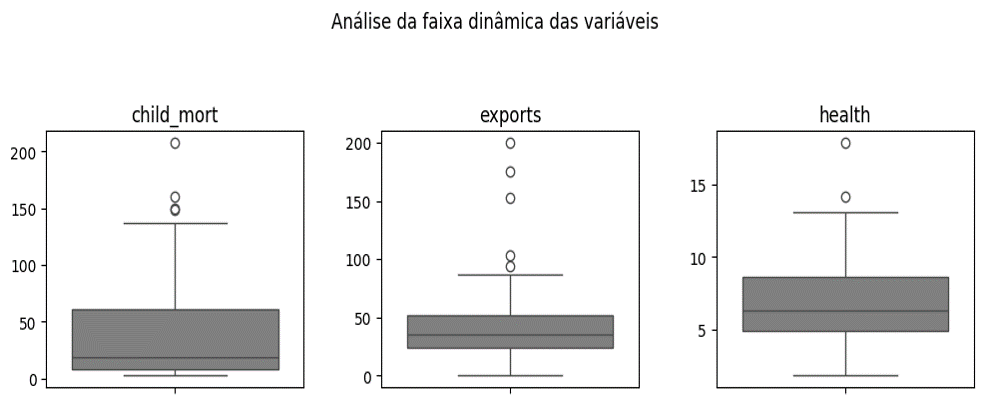
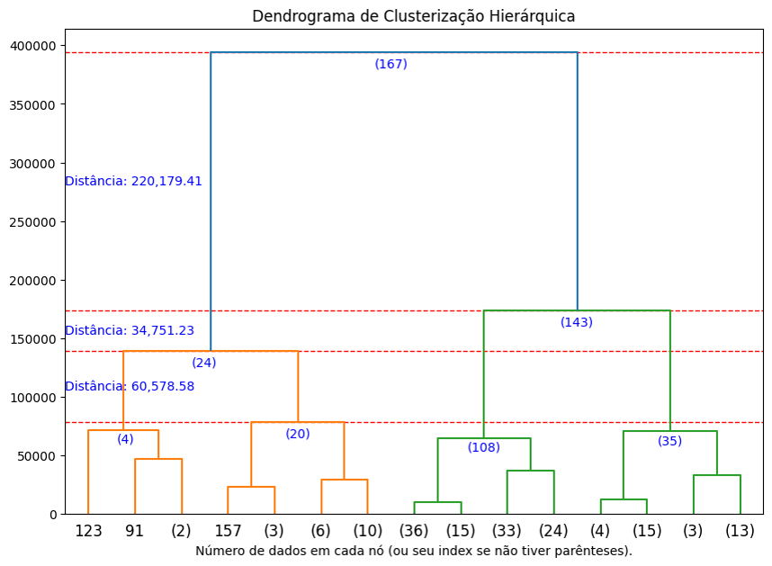

# Projeto de Disciplina de Algoritmos de Inteligência Artificial para Clusterização

Projeto de disciplina de clusterização, utilizando modelos de aprendizado não supervisionado.

## Índice

- <a href='#tecnologias'>1. Tecnologias</a>
- <a href='#análises'>2. Análises</a>
- <a href='#sobre-mim'>3. Sobre mim</a> 

## Tecnologias

 Jupyter Notebook v. 5.7.2

 Python v. 3.10

- 

    
    
    OBS: Para fins de compatibilidade com o sklearn, foi utilizada a biblioteca do Numpy v. 1.26.4, conforme descrito em '📄 requeriments.txt'.
    
  
 

 Anaconda v. 23.7.4 (ambiente virtual chamado '⚙️ venv_clusterizacao2')

## Análises

O projeto realiza análises gráficas de clusterização do arquivo '🌎 country-data.csv' que possui informações econômicas e politicas sobre os países.

Para isso, o projeto faz uma análise exploratória da faixa de distribuição dos dados com boxplot, para verificar se há ou não a presença de outliers.

    

Além disso, o projeto implementa os modelos de K-Means, K-Medoids, HCluster (Clusterização Hierárquica), DBSCAN, onde, basicamente:

- **K-Means**: um modelo de agrupamento (clusterização) de dados numéricos com o objetivo de agrupar dados próximos e encontrar o centro de cada grupo (centroide) até a sua convergência (ponto em que o agrupamento dos dados e o deslocamento dos centroides se torna mínimo ou nulo). Para isso, ele utiliza o hiperparâmetro do número de clusters;

- **K-Medoid**: este modelo segue a mesma ideia que o K-Means (embora possa ter métricas diferentes), porém o objetivo é garantir que o centroide seja, necesssariamente o dado mais próximo do centro, qual chamamos de medoide. Para isso, ele também utiliza o hiperparâmetro do número de clusters;

- **HCluster (ou classificação hierárquica)**: este modelo agrupa os dados em diferentes níveis de granulidade, de modo que os primeiros dados comuns  agrupados no primeiro nível também fazem parte dos níveis acima, formando uma hierarquia entre os grupos. O diferencial deste modelo é que, como ele tem o propósito de auxiliar na verificação do melhor número de clusters, ele não xige nenhum hiperparâmetro inicial;

- **DBSCAN**: este modelo classifica os dados nos grupos principais e isola os possíveis outliers (dados cujos valores estão muito equidistantes da maioria). Para isso, ele utiliza dois hiperparâmetros: o "eps" (o tamanho do raio de busca) e o "MinPts" (o número mínimo de pontos necessários que o raio de busca daquele dado precisa encontrar). Este modelo é muito usado para dados mais densos.

O algoritmo imprime gráficos de dispersão para o K-Means, K-Medoid e DBSCAN:

    

E um dendrograma para análise de HCluster.

    

No final, o algortimo ainda realiza uma checagem de similaridade entre os modelos de modo a demonstrar a diferença entre as metricas e otimizações dde cada modelo.

## Sobre mim

    
    

        

        Mateus Teixeira
        

        Pós-graduando em Inteligência Artifcial pela INFNET
         
         
        
        
        
    

